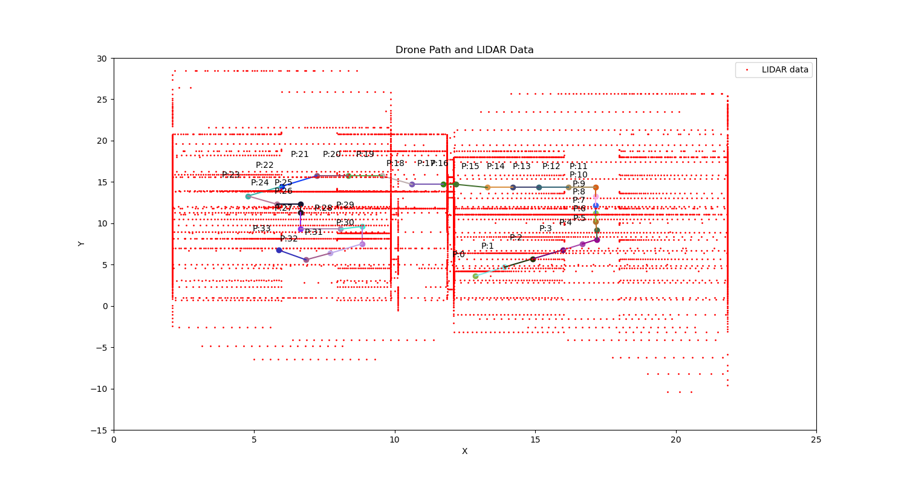

# Drone flight mapping and localization using 2D Lidar

## `lidar_analysis.py`
> This script is designed to read flight path and LiDAR measurement files and extract and visualize data from them. It takes command-line arguments using `argparse` module, and the functionality of the script depends on the arguments passed.

### Required Arguments
- `--flightPath`: A path to a file containing flight path coordinates.
- `--lidarPoints`: A path to a file containing LiDAR measurements.

### Optional Arguments
- `--show`: Display the visualizations in a window. Default is `False`.
- `--sweepsInIsolation`: Visualize LiDAR data for each sweep separately. Default is `False`.
- `--allSweepsCombined`: Visualize all drone locations along with each sweep's measurements. Default is `False`.

### Functionality
- Check if required input arguments are present and valid files.
- Read flight path and LiDAR measurements from files.
- Extract measurements from each sweep.
- Combine sweep ID, drone position, and LiDAR measurements.
- Visualize LiDAR data per sweeps.
- Visualize all drone locations along with each sweep's measurements.

### Usage
`python lidar_analysis.py --flightPath <pathToFlightPath.csv> --lidarPoints <pathToLidarData.csv> [--show] [--sweepsInIsolation] [--allSweepsCombined]`

- `--flightPath`: Path to the flight path coordinates file.
- `--lidarPoints`: Path to the LiDAR measurements file.
- `--show`: Display the visualizations in a window.
- `--sweepsInIsolation`: Visualize LiDAR data for each sweep separately.
- `--allSweepsCombined`: Visualize all drone locations along with each sweep's measurements.

- example: `python3 lidar_analysis.py --flightPath ./data/FlightPath.csv --lidarPoints ./data/LIDARPoints.csv --show --sweepsInIsolation --allSweepsCombined`

# Results
## TASK 1: Display
### Create a program to provide an appropriate visualization of the drone’s path and the LIDAR data. Ideally, the display should be able to show 1 sweep (1 scan ID) of data in isolation as well as all the sweeps combined together. This can be on separate displays or on the same display (with individual sweeps shown by highlighting for example)
> ## Individual sweeps

  
Click here to see all sweeps output plots

   

   

   

   

   

   

   

   

   

   

   

   

   

   

   

   

   

   

   

   

   

   

   

   

   

   

   

   

   

   

   

   

   

> ## All sweeps combined with flight path

## TASK 2: Simulation
### Generate new LIDARDPoints data based on a new room layout and new plausible flight plan. This data is not provided so you will need to create the layout and flight plan yourself. This can either be done manually (ensure you include your data with your submission) or programmatically.
- TODO

## TASK 3: Flight optimization
### Based on the data provided, find a better flight path that will result in the shortest possible travel time but still goes through the existing rooms. (Assume the first sampled location is the start point and the last sampled location is the end point)
- TODO

## TASK 4: Flight reroute
### Based on the data provided, find an alternative route that will take you to the end point faster. You may go through different rooms.
- TODO

## TASK 5: Mapping
### Use the multiple data sweeps to map out the dimensions of the rooms.
- TODO
