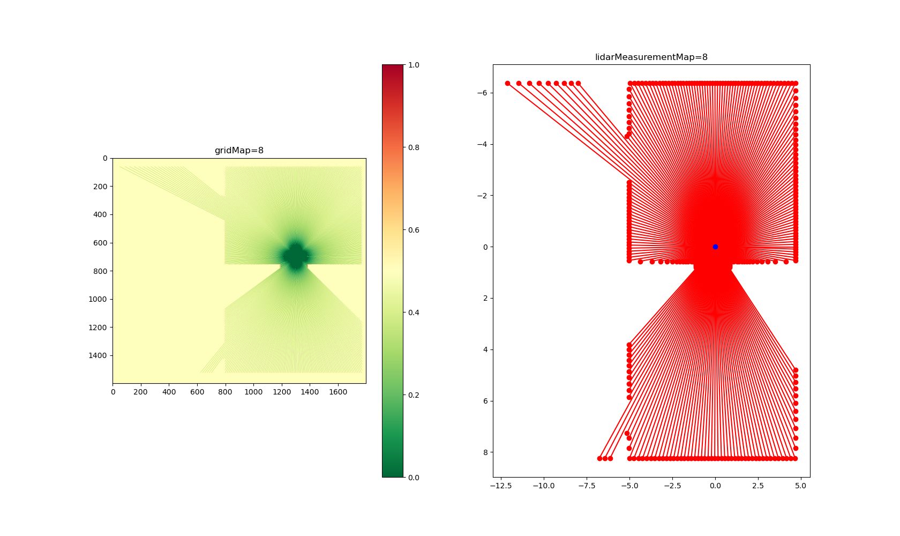

# Drone flight mapping and localization using 2D Lidar

# Structure
```.
├── CHANGELOG.md
├── LICENSE
├── README.md
├── data
│   ├── FlightPath.csv
│   └── LIDARPoints.csv
├── environment.yml
├── libs
│   ├── __init__.py
│   ├── lidarutils.py
│   ├── loghandler.py
│   └── mapping
│       ├── __init__.py
│       └── lidar_to_grid_map.py
├── output
├── task1.py
├── task2.py
└── test_lidar_analysis.py
```

# Requirements
- python=3.9
- ipython
- flake8
- numpy
- black
- pytest
- matplotlib=3.7.1

### To create the
```
conda env create -f environment.yml
```

### To activate this environment, use
```
conda activate lidar_analysis
```

### To deactivate an active environment, use
```
conda deactivate
```
# TASK 1: Display
### Create a program to provide an appropriate visualization of the drone’s path and the LIDAR data. Ideally, the display should be able to show 1 sweep (1 scan ID) of data in isolation as well as all the sweeps combined together. This can be on separate displays or on the same display (with individual sweeps shown by highlighting for example)

## Result
### `task1.py`
> This script is designed to read flight path and LiDAR measurement files and extract and visualize data from them. It takes command-line arguments using `argparse` module, and the functionality of the script depends on the arguments passed.

#### Required Arguments
- `--flightPath`: A path to a file containing flight path coordinates.
- `--lidarPoints`: A path to a file containing LiDAR measurements.

#### Optional Arguments
- `--show`: Display the visualizations in a window. Default is `False`.
- `--sweepsInIsolation`: Visualize LiDAR data for each sweep separately. Default is `False`.
- `--allSweepsCombined`: Visualize all drone locations along with each sweep's measurements. Default is `False`.

### Usage
`python task1.py --flightPath <pathToFlightPath.csv> --lidarPoints <pathToLidarData.csv> [--show] [--sweepsInIsolation] [--allSweepsCombined]`

- `--flightPath`: Path to the flight path coordinates file.
- `--lidarPoints`: Path to the LiDAR measurements file.
- `--show`: Display the visualizations in a window.
- `--sweepsInIsolation`: Visualize LiDAR data for each sweep separately.
- `--allSweepsCombined`: Visualize all drone locations along with each sweep's measurements.

#### example:
```
$ conda activate lidar_analysis
$ python task1.py --flightPath ./data/FlightPath.csv --lidarPoints ./data/LIDARPoints.csv --show --sweepsInIsolation --allSweepsCombined
```
### Functionality
- Check if required input arguments are present and valid files.
- Read flight path and LiDAR measurements from files.
- Extract measurements from each sweep.
- Combine sweep ID, drone position, and LiDAR measurements.
- Visualize LiDAR data per sweeps.
- Visualize all drone locations along with each sweep's measurements.

### Libraries
- `libs/mapping`: opensource library (https://atsushisakai.github.io/PythonRobotics) to generate gridMap and measurementMap for each sweep.
- `libs/lidarutils.py`: my functions to read and extract data from input flightpath and lidarPoints.
- `libs/loghandler.py`: my logger handler, based on the original design by https://stackoverflow.com/questions/384076/how-can-i-color-python-logging-output

### Unit Tests
- To ensure that the `ExtractSweepsFromMeasurements()` function works as expected. To run the tests, simply navigate to the parent directory and run `pytest`:

```
$ cd Lidar1D-X.x.x
$ pytest
```
- Should be able to see following results.
- The `2 failed` cases are expected, since here I am trying to make sure assertions are triggered.
```
====== short test summary info ======
FAILED test_lidar_analysis.py::TestExtractSweepsFromMeasurements::test_nan_values - AssertionError: angles should be in the range [0, 360]
FAILED test_lidar_analysis.py::TestExtractSweepsFromMeasurements::test_inf_values - AssertionError: angles should be in the range [0, 360]
====== 2 failed, 5 passed in 0.42s ======
```

## Output
 - Based on the "FlightPath.csv" and "LIDARPoints.csv", the Lidar took total of 34 sweeps measurements *not 18*. Also drone seem to have total of 34 waypoints.
 - Based on the Lidar sweeps visualizations, it seems there are total of 4 rooms. and Flight path was from room A->B->C-D.
- D :arrow_left: C
- :arrow_down: :arrow_up:
- A :arrow_right:  B

> ### Individual sweeps

<details>
  <summary>Click here to see all sweeps output plots</summary>

   

   

   

   

   

   

   

   

   

   

   

   

   

   

   

   

   

   

   

   

   

   

   

   

   

   

   

   

   

   

   

   

   

</details>


> ### All sweeps combined with flight path

- TODO: better visualization to combine all sweeps, perhaps related to [Task 5](#task-5-mapping)

# TASK 2: Simulation
### Generate new LIDARDPoints data based on a new room layout and new plausible flight plan. This data is not provided so you will need to create the layout and flight plan yourself. This can either be done manually (ensure you include your data with your submission) or programmatically.
## Result
### `task2.py`
> This script simulates LIDAR measurements and drone positions using NumPy and Matplotlib libraries in Python. The simulated LIDAR measurements are created by generating random values for angles and distances, while the drone positions are generated using NumPy's random.rand function.
## Usage
```
$ conda activate lidar_analysis
$ python task2.py
```
## Output
- *Note*: Random number generator is being used to generate values for angles, distances, drone positions, therefore it will give different result on every run.
- Below is an example from one of those runs.


# TASK 3: Flight optimization
### Based on the data provided, find a better flight path that will result in the shortest possible travel time but still goes through the existing rooms. (Assume the first sampled location is the start point and the last sampled location is the end point)
- TODO

# TASK 4: Flight reroute
### Based on the data provided, find an alternative route that will take you to the end point faster. You may go through different rooms.
- TODO

# TASK 5: Mapping
### Use the multiple data sweeps to map out the dimensions of the rooms.
- TODO
